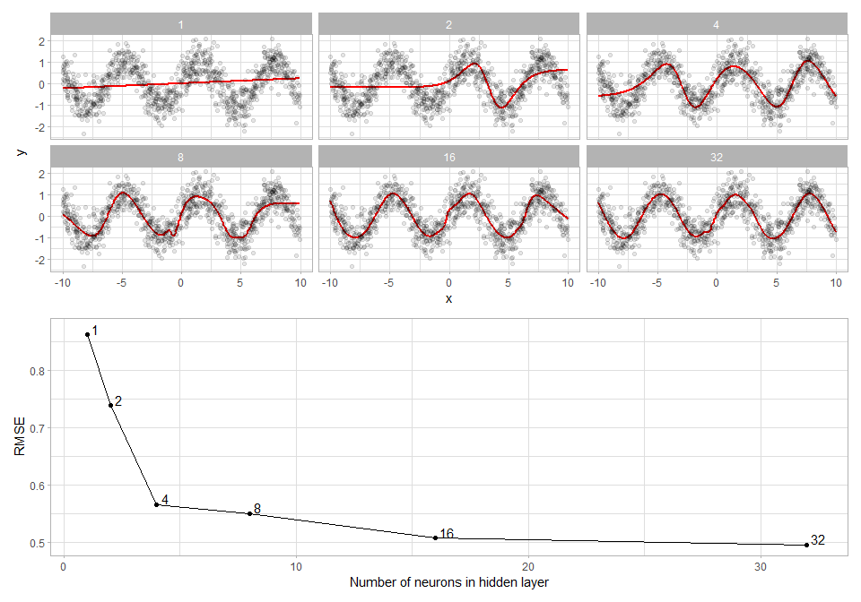

Here I generate some simple simulated data where y = sin(x) + e.

``` r
set.seed(123456)

library(tidyverse)
library(tidymodels)
library(modelr)
library(patchwork)

theme_set(theme_light())

data <- tibble(x = runif(1000, -10, 10),
               y = sin(x) + rnorm(1000, 0, 0.5))

data %>%
    ggplot(aes(x, y)) +
    geom_point()
```


<br />

I fit a multilayer perceptron (e.g., a single hidden layer feed forward
neural network) with various number of neurons from 1 to 32.

``` r
fit_nn <- function(n){
    fit(mlp(mode = "regression", hidden_units = n, activation = "relu"),
        formula = y ~ x,
        data = data)
}

results <- tibble(n = 2^(0:5)) %>%
    mutate(model = map(n, fit_nn)) %>%
    mutate(preds = map(model, add_predictions, data = data, type = "raw")) %>%
    unnest(preds) %>%
    mutate(pred = pred[ , 1])
```

<br />

Below I plot the same x, y data six times. On each plot I show the
neural network’s fit. With a small number of neurons in the hidden layer
the model cannot fit the data. However, once the level reaches a
significant level of complexity it can fit the sine wave. The bottom
plot shows the Root Mean Squared Error for each model with varying
levels of neurons in the hidden layer.

``` r
p1 <- ggplot() +
    geom_line(data = results, aes(x, pred), color = "red", size = 1) +
    geom_point(data = data, aes(x, y), alpha = 0.1) +
    facet_wrap(~n, ncol = 3) +
    labs(y = "y")

p2 <- results %>%
    group_by(n) %>%
    summarize(rmse = rmse_vec(y, pred)) %>%
    ungroup() %>%
    ggplot(aes(n, rmse, label = n)) +
    geom_point() +
    geom_line() +
    geom_text(hjust = "left", nudge_x = 1, nudge_y = .01) +
    labs(x = "Number of neurons in hidden layer",
         y = "RMSE")

p1 / p2
```



<br />

The networks with 16 and 32 hidden layers show signs of overfitting
where the model learns little curves in the functions that are not
representative of the underlying data generating function (e.g., y =
sin(x))

<br /> <br /> <br /> <br /> <br />
